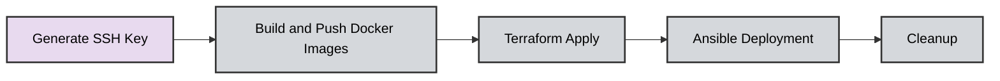

# ISS Tracker 
<pre>
                                                                    hello@you
                                                                    ----------
     -+#                                                            Project: cicd_flask
  .--+######                                                        Owner: ivnchvz
 ++++##########                         ------                      Repo: github.com/ivnchvz/cicd_flask
######+++#########             ..    --------+#                     Language: Python, Javascript
#########+++##########         ---+-------++++#                     Framework: Flask, NextJS
   ##########+++#########     ---------+#####                       Cloud: AWS
      ##########++++#######--------++####                           CI/CD: Jenkins
          ##########++++++-----+++#####                             Infraestructure: Terraform, Ansible
             ########+-------++++########                           Container: Docker
             ----+-------+++######++#########                       SCM: Github
             --------++++##++########+++#########                   Description: ISS tracker in real time
              +++++-+###---.-+++++######+++########                 Live: iss.ivnchvz.com
              #######      .------+#########++#########             Status: Active
                             --+#     ##########+######   
                                         ##########+++-   
                                            ##########+--#          █████████▓▓▓▓▓▓▒▒▒▒█████▓▓▓▓▓▓▓▓▒▒▒▒▒
                                                 #######            ▓▓▓▓▓▓▓▓▓▓▒▒▒▒▒░░░░█████▓▓▓▓▒▒▒▒▒░░░░
                                                    #     
                                                                   
</pre>
---

## 🚀 Purpose
The main broad objective of the ISS tracker is to provide a modern-looking option for users to keep position of the ISS (International Space Station) 
This allows anyone to calculate sightnings of the satellite in their current position, observate the path traversed by it to learn how orbital elements behave, and simply create a nice atmosphere that relaxes and seeds curiosity on the user. 
## 🔸DevOps 
This application is part of a personal project for my resume to showcase the use of modern DevOps technologies and practices, which we will explain in greater detail in the following sections.
## 🔸 Prep
#### Kanban Board
As part of good DevOps practices, I rolled a on-premises Kanban board to keep track of every task or feature that there is to complete, for a simplified project as this one, I sectioned the board into three different lists: *To-do*, *In-Progress*, and *Done*.
| To-do | In-Progress | Done |
| --- | --- | --- |
|       |             |      |
|       |             |      |
|       |             |      |
|       |             |      |

#### GitHub
First and main thing around this project is to initialize the repository where our code is going to reside in, in this case my SCM of preference is GitHub and I'll be using the git CLI to manipulate it.

1. First we'll create an ssh key that will connect our terminal with our GitHub account.
2. We initialize our working directory with *git init*.
3. Then create a repository where all of our code is going to be hosted at and commit for the first time the *readme.md* file.

#### Venv
The project will consist of a simple Flask application in which we'll make use of the *flask* and *requests* dependencies, to isolate these from the whole system, we are going to utilize a virtual environment.

#### Docker
To easily manage both our frontend and our backend we are going to containerize our applications, this will allow us to seamlessly run it in any computer that has docker installed on it, plus will simplify the process of transporting the application artifact to our production server.

1. In order to install docker engine, we'll follow the instructions written in the official [docs](https://docs.docker.com/engine/install/)
2. We'll create a Dockerhub account that will host our application images

## 🔸 Backend
Very simply put our backend fetches the coordinates of the ISS (International Space Station) with the [WTIA API](https://wheretheiss.at/w/developer) , data that is at the same time provided by [Celestrak](https://celestrak.org/)
## 🔸 Frontend
Our NextJS application is fed the data that we retrieve, and said coordinates are drawn into our globe component
## 🔸 Jenkins
Jenkins is running as a container in our local server that runs the following pipeline

